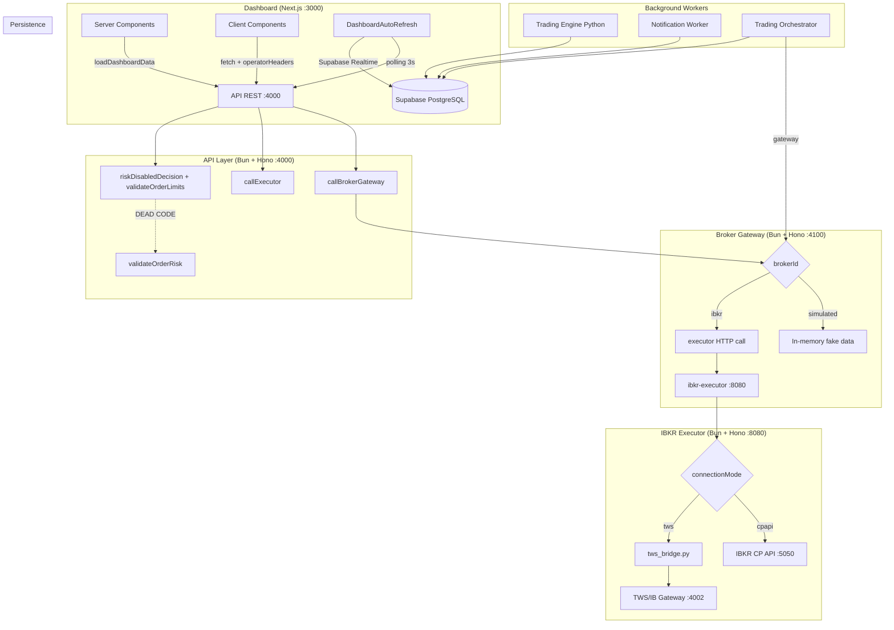

# Plan de Acción: ALFA-OMEGA Hardening

> Generado: 2026-06-17
> Basado en análisis de código completo (11 servicios, 25+ archivos fuente)

---

## Resumen Ejecutivo

ALFA-OMEGA tiene **15 hallazgos críticos/altos** identificados en el análisis de código. Trece de ellos persisten sin resolver. Las mejoras recientes (marketdata real, reconciliación de posiciones, broker_perm_id, comisiones, TWS connect resiliencia) son correctas pero no abordan los problemas de fondo.

El riesgo general se mantiene en **Alto** hasta que se activen el risk-engine real, el kill switch, y se corrijan los bugs en el motor Python.

---

## Hallazgos Críticos y Altos

| # | Severidad | Hallazgo | Archivo | Línea |
|---|-----------|----------|---------|-------|
| C1 | CRÍTICO | `kill_switch` se lee pero **nunca se ejecuta** — la API lee el valor de Supabase y lo ignora | `apps/api/src/index.ts` | 530, 1417-1418 |
| C2 | CRÍTICO | `validateOrderRisk` se importa pero **nunca se llama** — todo el risk-engine es dead code | `apps/api/src/index.ts` | 1, 0 usos |
| C3 | CRÍTICO | Risk-engine (`packages/risk-engine`) no se usa en **ningún servicio** — API, executor ni gateway lo invocan | Múltiples | — |
| C4 | CRÍTICO | `signal.get("entry_price") or 100` — precio 0 se reemplaza por 100 (falsy fallback) | `apps/trading-engine/main.py` | 128-129 |
| C5 | CRÍTICO | Dos familias de tablas paralelas: `trades/signals` vs `trade_orders/trading_signals` sin sincronización | `supabase/migrations/001-007` | — |
| C6 | ALTO | `operatorHeaders()` crashea si Supabase no está configurado (`null?.auth` → TypeError) | `apps/dashboard/src/lib/operator-api.ts` | 6 |
| C7 | ALTO | `OPERATOR_AUTH_REQUIRED` por defecto desactivado | `apps/api/src/index.ts` | 28 |
| C8 | ALTO | API keys por defecto son strings vacíos en 6 servicios distintos | Múltiples | — |
| C9 | ALTO | Sin error boundaries en todo el dashboard (0 archivos `error.tsx`) | `apps/dashboard/src/app/` | — |
| C10 | ALTO | Recursión circular sin protección en 4 funciones del orchestrator | `apps/trading-orchestrator/src/index.ts` | 41-71, 74-88, 90-150, 132-146 |
| C11 | ALTO | `String(null)` retorna `"null"` (truthy) — `if (!instrumentId)` no lo detecta | `apps/trading-orchestrator/src/index.ts` | 122, 125 (corregido en código nuevo vía `?? ""`) |
| C12 | ALTO | `accountMode: "paper"` hardcodeado en órdenes programadas | `apps/trading-orchestrator/src/index.ts` | 187 |
| C13 | ALTO | Gemini API key expuesta en URL query parameter (`?key=...`) | `apps/api/src/index.ts` | 818 |
| C14 | ALTO | Python catch genérico pierde stack traces | `apps/trading-engine/main.py` | 372-376 |
| C15 | ALTO | Sin timeouts en `fetch` a servicios downstream (8+ ubicaciones) | Múltiples | — |

---

## Fase 1 — Risk Engine Real + Kill Switch (Semana 1, Urgente)

**Objetivo:** Activar el risk-engine que está importado pero nunca se llama, y ejecutar el kill switch.

### 1.1 Llamar `validateOrderRisk()` en v1 y v2

**Archivo:** `apps/api/src/index.ts`

**Contexto actual:** Las líneas 1397-1515 (`handleTradingOrder`, v1) y 1697-1895 (v2) usan funciones inline `riskDisabledDecision()` (línea 223) y `validateOrderLimits()` (línea 263) que duplican la lógica del risk-engine.

**Acción:** Reemplazar ambas funciones inline con llamadas a `validateOrderRisk()` del risk-engine.

```typescript
// Antes (v1, línea 1418):
const decision = riskDisabledDecision(parsed.data.accountMode, apiAllowLiveTrading && runtime.allow_live_trading);

// Después:
const riskInput: RiskInput = {
  ...parsed.data,
  allowLiveTrading: apiAllowLiveTrading && runtime.allow_live_trading,
  allowedSymbols: limits.allowedSymbols,
  dailyTrades: limits.maxDailyTrades, // o calcular desde DB
  killSwitch: runtime.kill_switch,
  maxDailyTrades: limits.maxDailyTrades,
  maxOrderNotional: limits.maxOrderNotional,
  maxOrderQty: limits.maxOrderQty,
  idempotencyKeyExists: duplicate, // precomputado
};
const decision = validateOrderRisk(riskInput);
```

**Pasos:**
1. Eliminar `riskDisabledDecision()` (líneas 223-237)
2. Eliminar `validateOrderLimits()` (líneas 263-324)
3. Eliminar `OrderLimitDecision` type (líneas 209-221)
4. En `handleTradingOrder()`: construir `RiskInput` y llamar `validateOrderRisk()`
5. En v2: mismo patrón
6. Verificar que `insertRiskEvent()` recibe `RiskDecision` (ya está tipado, línea 624)

### 1.2 Pasar `kill_switch` a la validación

**Archivo:** `apps/api/src/index.ts`, líneas 1417-1418

**Contexto:** `runtime.kill_switch` se lee en línea 530 (`kill_switch: data?.kill_switch ?? true`) pero nunca se pasa a ninguna función de validación.

**Acción:** Incluir `killSwitch: runtime.kill_switch` en el `RiskInput` que se pasa a `validateOrderRisk()`.

### 1.3 Tests faltantes del risk-engine

**Archivo:** `packages/risk-engine/src/index.test.ts`

**Tests actuales:** 12 tests, 5 reglas sin cubrir.

**Tests a agregar:**
| Regla | Caso |
|-------|------|
| `kill_switch` | killSwitch=true → rejected |
| `kill_switch` | killSwitch=false → passes |
| `quantity_positive` | quantity=0 → rejected |
| `quantity_positive` | quantity=-1 → rejected |
| `insufficient_cash` | BUY, notional > availableCash → rejected |
| `insufficient_cash` | availableCash undefined → passes (optional) |
| `insufficient_position` | SELL, quantity > availablePositionQty → rejected |
| `max_daily_trades` | dailyTrades >= maxDailyTrades → rejected |
| Boundary | quantity = maxOrderQty → passes |
| Boundary | notional = maxOrderNotional → passes |

---

## Fase 2 — Tests + CI/CD (Semana 1-2, Urgente)

### 2.1 Estructura de tests por servicio

```yaml
packages/risk-engine/:
  - src/index.test.ts         # Tests unitarios (14 reglas)
  - coverage: 100% de reglas

apps/api/:
  - src/__tests__/health.test.ts
  - src/__tests__/signals.test.ts
  - src/__tests__/orders.test.ts
  - src/__tests__/risk.test.ts

apps/broker-gateway/:
  - src/__tests__/gateway.test.ts    # Simulated + IBKR mock

apps/ibkr-executor/:
  - src/__tests__/executor.test.ts   # Dry-run, auth, schemas
```

### 2.2 GitHub Actions CI

**Archivo:** `.github/workflows/ci.yml`

```yaml
name: CI
on: [push, pull_request]
jobs:
  ci:
    runs-on: ubuntu-latest
    steps:
      - uses: actions/checkout@v4
      - uses: oven-sh/setup-bun@v2
      - run: bun install
      - run: bun run typecheck
      - run: bun test
      - run: bun run build
  python:
    runs-on: ubuntu-latest
    if: contains(github.event.head_commit.modified, 'apps/trading-engine/')
    steps:
      - uses: actions/checkout@v4
      - uses: actions/setup-python@v5
        with: { python-version: '3.11' }
      - run: pip install -r apps/trading-engine/requirements.txt
      - run: pip install pytest
      - run: pytest apps/trading-engine/
```

---

## Fase 3 — Bugs en Python + Orchestrator (Semana 2, Urgente)

### 3.1 Corregir falsy fallback en `build_trade()`

**Archivo:** `apps/trading-engine/main.py`, líneas 128-131

**Problema:** `signal.get("entry_price") or 100` — si `entry_price` es `0`, `None` o `False`, se reemplaza por `100`.

**Solución:**
```python
# Antes:
entry = Decimal(str(signal.get("entry_price") or 100))
stop = Decimal(str(signal.get("stop_loss") or (entry * Decimal("0.99"))))

# Después:
raw_entry = signal.get("entry_price")
entry = Decimal(str(raw_entry if raw_entry is not None else 100))
raw_stop = signal.get("stop_loss")
stop = Decimal(str(raw_stop if raw_stop is not None else entry * Decimal("0.99")))
take_profit_1 = signal.get("take_profit_1")
take_profit_2 = signal.get("take_profit_2")
```

### 3.2 Stack traces en catch genérico

**Archivo:** `apps/trading-engine/main.py`, líneas 372-376

```python
# Antes:
except Exception as error:
    print(f"Error worker: {error}")

# Después:
import traceback
except Exception as error:
    print(f"Error worker: {error}")
    traceback.print_exc()
```

### 3.3 Proteger recursión circular en orchestrator

**Archivo:** `apps/trading-orchestrator/src/index.ts`

**Funciones afectadas:**
- `brokerOrderState()` (líneas 41-71)
- `brokerExecutions()` (líneas 74-88)
- `brokerPositions()` (líneas 90-150)

**Solución:** Agregar `seen` Set con límite de profundidad:

```typescript
function brokerOrderState(input: unknown, _depth = 0): ReconciledBrokerOrderState | null {
  if (_depth > 20) return null; // safety limit
  // ... existing logic, passing _depth + 1 on recursive calls
}
```

### 3.4 `accountMode: "paper"` no hardcodeado

**Archivo:** `apps/trading-orchestrator/src/index.ts`, línea 187

```typescript
// Antes:
accountMode: "paper",

// Después:
accountMode: schedule.account_mode ?? "paper",
```

### 3.5 Validar `next_run_at` nulo

**Archivo:** `apps/trading-orchestrator/src/index.ts`, línea 197-201

```typescript
// Antes:
new Date(schedule.next_run_at)

// Después:
const baseDate = schedule.next_run_at ? new Date(schedule.next_run_at) : new Date();
```

---

## Fase 4 — Seguridad y Auth (Semana 2-3, Alta)

### 4.1 Activar auth por defecto

**Archivo:** `apps/api/src/index.ts`, línea 28

```typescript
// Antes:
const operatorAuthRequired = process.env.OPERATOR_AUTH_REQUIRED === "true";

// Después:
const operatorAuthRequired = process.env.OPERATOR_AUTH_REQUIRED !== "false";
```

**Efecto:** Por defecto, todas las rutas no-GET bajo `/api/*` requieren autenticación. Se puede desactivar explícitamente con `OPERATOR_AUTH_REQUIRED=false` para desarrollo.

### 4.2 Validar API keys al startup

**Archivo:** `apps/api/src/index.ts`, después de línea 42

```typescript
// Validar que las API keys no estén vacías ni sean el default conocido
const knownInsecureKeys = ["", "change_me_internal_secret"];
if (knownInsecureKeys.includes(operatorApiKey)) {
  console.warn("[SECURITY] OPERATOR_API_KEY is empty or default. Set a secure value in production.");
}
if (knownInsecureKeys.includes(ibkrExecutorApiKey)) {
  console.warn("[SECURITY] IBKR_EXECUTOR_API_KEY is empty or default.");
}
if (knownInsecureKeys.includes(brokerGatewayApiKey)) {
  console.warn("[SECURITY] BROKER_GATEWAY_API_KEY is empty or default.");
}
```

**Mismo patrón en:** `apps/broker-gateway/src/index.ts` (línea 18), `apps/ibkr-executor/src/config.ts` (línea 4)

### 4.3 Gemini API key en header no en URL

**Archivo:** `apps/api/src/index.ts`, línea 818

```typescript
// Antes:
const url = `${geminiBaseUrl}/models/${geminiModel}:streamGenerateContent?key=${encodeURIComponent(geminiApiKey)}`;

// Después:
const url = `${geminiBaseUrl}/models/${geminiModel}:streamGenerateContent`;
const headers = {
  "content-type": "application/json",
  "x-goog-api-key": geminiApiKey, // Google SDK estándar
};
```

### 4.4 Rate limiting

**Archivo:** `apps/api/src/index.ts`

**Endpoints críticos:** `/assistant/chat` (Gemini cuesta dinero), `/kapso-webhook`, `/api/trading/orders/submit`

```typescript
import { rateLimiter } from "hono-rate-limiter";

app.use("/assistant/chat", rateLimiter({
  windowMs: 60 * 1000, // 1 minuto
  max: 10, // 10 requests por minuto
  message: { ok: false, error: "rate limit exceeded" }
}));
```

### 4.5 `requireSupabase()` no debe tirar 500

**Archivo:** `apps/api/src/index.ts`, líneas 371-377 y 2016-2135

```typescript
// Antes: throw new Error("Supabase is required") → 500
// Después: return 503 con mensaje claro

function requireSupabase():
  { client: SupabaseClient } | { error: Response } {
  const client = getSupabase();
  if (!client) {
    return { error: c.json({ ok: false, error: "Supabase is required for this feature. Configure SUPABASE_URL and SUPABASE_SERVICE_ROLE_KEY." }, 503) };
  }
  return { client };
}
```

### 4.6 CORS restrictivo

**Archivo:** `apps/api/src/index.ts`, línea 19

```typescript
// Antes:
app.use("*", cors());

// Después:
app.use("*", cors({
  origin: process.env.CORS_ORIGIN || "http://localhost:3000",
  credentials: true,
}));
```

---

## Fase 5 — Dashboard Resiliencia (Semana 3, Alta)

### 5.1 Error boundaries por ruta

**Archivo a crear:** `apps/dashboard/src/app/error.tsx`

```typescript
"use client";
export default function Error({ error, reset }: { error: Error; reset: () => void }) {
  return (
    <div className="flex h-screen items-center justify-center">
      <div className="rounded border border-rose-400/20 bg-rose-500/10 p-6 text-center">
        <h2 className="text-lg font-semibold text-rose-200">Error al cargar</h2>
        <p className="mt-2 text-sm text-rose-300">{error.message}</p>
        <button onClick={reset} className="mt-4 rounded bg-rose-500/20 px-4 py-2 text-sm text-rose-100">
          Reintentar
        </button>
      </div>
    </div>
  );
}
```

**Crear para cada ruta:** mismo archivo en cada `app/*/error.tsx`
- `app/error.tsx`
- `app/control/error.tsx`
- `app/automatizacion/error.tsx`
- `app/operaciones/error.tsx`
- etc.

### 5.2 `operatorHeaders()` seguro

**Archivo:** `apps/dashboard/src/lib/operator-api.ts`, línea 6

```typescript
// Antes:
const supabase = getSupabaseBrowserClient();
const session = await supabase.auth.getSession();

// Después:
const supabase = getSupabaseBrowserClient();
if (!supabase) return {}; // Sin auth si Supabase no está configurado
const { data } = await supabase.auth.getSession();
if (data?.session?.access_token) {
  return { Authorization: `Bearer ${data.session.access_token}` };
}
return {};
```

### 5.3 Centralizar `apiBaseUrl`

**Archivo a crear:** `apps/dashboard/src/lib/api.ts`

```typescript
export const API_BASE_URL = process.env.NEXT_PUBLIC_API_BASE_URL || "http://localhost:4000";
```

**Eliminar** las 9 declaraciones duplicadas de `apiBaseUrl` en:
- `assistant-panel.tsx:19`
- `scheduled-round-trip-panel.tsx:12`
- `consolidated-orders-table.tsx:9`
- `control-panel.tsx:9`
- `history-tabs.tsx:17`
- `order-limits-panel.tsx:13`
- `paper-ibkr-order-panel.tsx:11`
- `risk-settings-panel.tsx:16`
- `trading-automation-panel.tsx:12`

### 5.4 Manejar `res.json()` fallido

**Patrón actual (6+ componentes):**
```typescript
if (!res.ok) {
  const json = await res.json(); // CRASH si no es JSON
  throw new Error(json.error);
}
```

**Patrón seguro:**
```typescript
if (!res.ok) {
  const text = await res.text().catch(() => "");
  try { throw new Error(JSON.parse(text).error ?? `Error ${res.status}`); }
  catch { throw new Error(`Error ${res.status}: ${text.slice(0, 200)}`); }
}
```

### 5.5 Unificar OrderLimitsPanel + RiskSettingsPanel

**Archivos:** `order-limits-panel.tsx`, `risk-settings-panel.tsx`

**Acción:** Fusionar en `RiskAndLimitsPanel.tsx`.

```typescript
interface RiskAndLimits {
  allowedSymbols: string;
  maxDailyOrders: number;
  maxDailyRiskPct: number;
  maxOpenTrades: number;
  maxOrderNotional: number;
  maxOrderQty: number;
  riskPerTradePct: number;
}
```

- Leer desde `/api/order-limits` y `/api/risk/settings`
- Escribir a ambos endpoints
- La página `/riesgo` redirige a `/limites`

### 5.6 Unificar español/inglés

| Actual | Corrección |
|--------|-----------|
| `"Unlock"` | `"Desbloquear"` |
| `"Preview"` | `"Previsualizar"` |
| `"Order ID"` | `"ID de orden"` |
| `"Exchange"` | `"Mercado"` (o mantener "Exchange") |
| `"Online"` | `"En línea"` |

---

## Fase 6 — Unificar Schema Dual (Semana 3-4, Alta)

### 6.1 Situación actual

| Familia 1 (Python Engine) | Familia 2 (Orchestrator + API) |
|--------------------------|-------------------------------|
| `signals` (mig001) | `trading_signals` (mig003) |
| `trades` (mig001) | `trade_orders` (mig003) |
| `notifications` (mig001) | — |
| `system_logs` (mig001) | — |
| `market_prices` (mig002) | — |
| — | `order_legs` (mig004) |
| — | `order_status_events` (mig004) |
| — | `broker_accounts` (mig004) |
| — | `recurring_schedules` (mig004) |
| — | `strategy_configs` (mig004) |

### 6.2 Decisión

**Opción recomendada:** Migrar el Python engine a usar las tablas modernas (`trading_signals`, `trade_orders`).

### 6.3 Acciones

1. Crear migración `008_unify_schema.sql` que:
   - Marque `signals` y `trades` como obsoletas (comentario en tabla)
   - Copie datos existentes de `signals` → `trading_signals`
   - Copie datos existentes de `trades` → `trade_orders`
2. Actualizar `apps/trading-engine/main.py` para leer/escribir en `trading_signals` y `trade_orders`
3. Migrar `notifications` y `system_logs` si aplica

---

## Fase 7 — Monitoreo y Operaciones (Semana 4-5, Media)

### 7.1 Health checks entre servicios

**API** (`apps/api/src/index.ts`):

```typescript
app.get("/health", async (c) => {
  const checks = {
    self: "ok",
    brokerGateway: await fetch("http://localhost:4100/health").then(r => r.ok ? "ok" : "degraded").catch(() => "down"),
    executor: await fetch("http://localhost:8080/health").then(r => r.ok ? "ok" : "degraded").catch(() => "down"),
  };
  const status = Object.values(checks).includes("down") ? 503 : 200;
  return c.json({ ok: status === 200, checks }, status);
});
```

### 7.2 Timeouts en todos los fetch

**Archivos afectados:** `apps/api/src/index.ts`, `apps/broker-gateway/src/index.ts`, `apps/ibkr-executor/src/index.ts`, `apps/trading-orchestrator/src/index.ts`

```typescript
// Helper compartido:
async function fetchWithTimeout(url: string, options: RequestInit = {}, timeout = 5000) {
  const controller = new AbortController();
  const id = setTimeout(() => controller.abort(), timeout);
  try {
    const response = await fetch(url, { ...options, signal: controller.signal });
    return response;
  } finally {
    clearTimeout(id);
  }
}
```

### 7.3 Graceful shutdown

**Archivos:** `apps/trading-orchestrator/src/index.ts`, `apps/notification-worker/src/index.ts`, `apps/trading-engine/main.py`

```typescript
// TypeScript:
const interval = setInterval(cycle, intervalMs);
process.on("SIGTERM", () => {
  console.log("Shutting down...");
  clearInterval(interval);
  process.exit(0);
});
process.on("SIGINT", () => {
  clearInterval(interval);
  process.exit(0);
});
```

```python
# Python:
import signal
running = True
def handle_signal(signum, frame):
    global running
    running = False
signal.signal(signal.SIGTERM, handle_signal)
signal.signal(signal.SIGINT, handle_signal)
while running:
    try:
        process_once()
        time.sleep(POLL_INTERVAL)
    except Exception as error:
        print(f"Error worker: {error}")
        traceback.print_exc()
        time.sleep(POLL_INTERVAL)
```

### 7.4 Script de validación de entorno

**Archivo:** `scripts/validate-env.mjs`

```javascript
const REQUIRED = {
  api: ["API_PORT", "SUPABASE_URL", "SUPABASE_SERVICE_ROLE_KEY", "OPERATOR_API_KEY"],
  dashboard: ["NEXT_PUBLIC_API_BASE_URL", "NEXT_PUBLIC_SUPABASE_URL"],
  executor: ["IBKR_DRY_RUN", "IBKR_CONNECTION_MODE", "EXECUTOR_API_KEY"],
  broker: ["BROKER_GATEWAY_PORT", "BROKER_GATEWAY_API_KEY", "IBKR_EXECUTOR_API_KEY"],
  engine: ["SUPABASE_URL", "SUPABASE_SERVICE_ROLE_KEY"],
  orchestrator: ["SUPABASE_URL", "SUPABASE_SERVICE_ROLE_KEY", "BROKER_GATEWAY_URL"],
};

const DEFAULTS_KNOWN_INSECURE = ["", "change_me_internal_secret"];

let errors = 0;
for (const [service, vars] of Object.entries(REQUIRED)) {
  for (const v of vars) {
    if (!process.env[v]) {
      console.error(`[MISSING] ${service}: ${v} is not set`);
      errors++;
    } else if (DEFAULTS_KNOWN_INSECURE.includes(process.env[v])) {
      console.warn(`[INSECURE] ${service}: ${v} has default/insecure value`);
    }
  }
}
if (errors > 0) {
  console.error(`\n${errors} required env vars missing. Aborting.`);
  process.exit(1);
}
console.log("[OK] All required env vars are set.");
```

---

## Fase 8 — Documentación (Semana 5-6, Baja)

### 8.1 CHANGELOG.md

```markdown
# Changelog

## [Unreleased]
### Added
- Market data endpoint (API → broker-gateway → simulated/IBKR)
- Position reconciliation in orchestrator (broker_positions upsert)
- Commission tracking in execution reconciliation
- broker_perm_id persistence in trade_orders
- TWS connection resilience (multiple host fallback)
- Market data UI in trading automation panel

### Fixed
- InstrumentId null-safety in position reconciliation (`?? ""` en lugar de `?? null`)
- TWS marketdata now returns live/delayed data instead of stub

### Security
- [PENDING]
```

### 8.2 Revisión cruzada docs vs código

Leer cada sección de `docs/guia-funcionamiento-aplicacion.md` y `README.md` contra:

- Cada vista del dashboard
- Cada endpoint de la API
- Cada regla del risk-engine

Corregir discrepancias documentadas.

### 8.3 Diagrama de arquitectura

**Archivo:** `docs/arquitectura.md`



---

## Resumen de Esfuerzo

| Fase | Días | Prioridad | Dependencias | Progreso |
|------|------|-----------|-------------|----------|
| F1 — Risk Engine real | 2-3d | 🔥 Urgente | — | 0% |
| F2 — Tests + CI/CD | 3-5d | 🔥 Urgente | F1 | 0% |
| F3 — Bugs Python/Orch | 2-3d | 🔥 Urgente | — | 0% |
| F4 — Seguridad | 3-4d | Alta | — | 0% |
| F5 — Dashboard | 3-4d | Alta | — | 0% |
| F6 — Schema dual | 2-3d | Alta | F3 | 0% |
| F7 — Monitoreo | 3-4d | Media | F4 | 0% |
| F8 — Documentación | 2-3d | Baja | F1-F7 | 0% |
| **Total** | **20-29d** | | | |

---

## Lo que ya funciona bien (no tocar)

- Arquitectura en capas (Dashboard → API → Risk → Gateway → Executor → Broker)
- Dry-run mode (`IBKR_DRY_RUN=true` por defecto)
- Live trading bloqueado por defecto
- Modo simulado para pruebas sin broker
- Marketdata real desde TWS con fallback delayed
- Reconciliación de posiciones, ejecuciones y comisiones
- Ordenes bracket con stop loss y take profit
- Auto-refresh vía polling + Supabase Realtime
- Documentación operativa en español (guia-funcionamiento-aplicacion.md)
